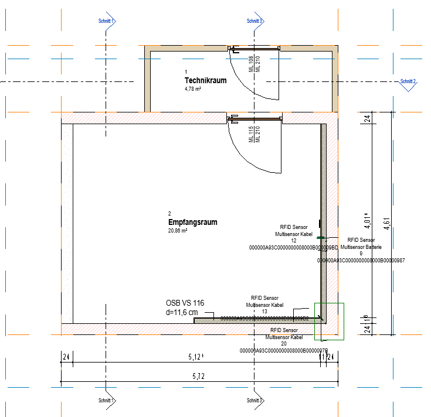
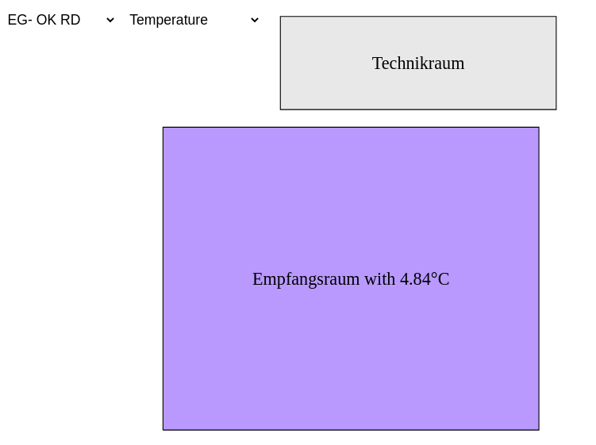
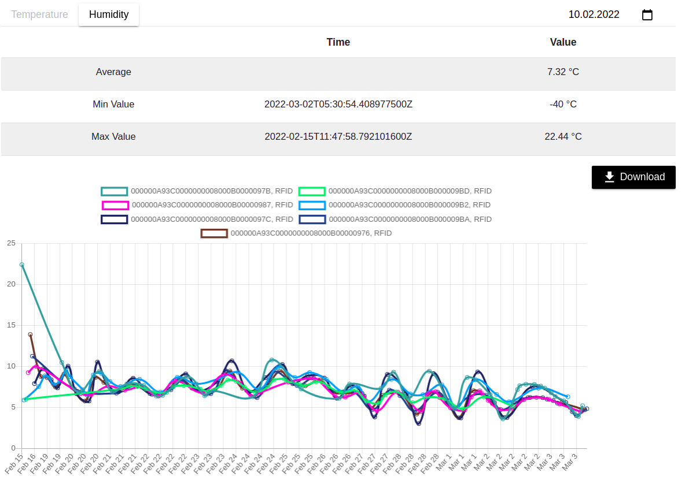

# SensorBIM

This application was developed as part of the SensorBIM project of the University of Innsbruck.

This makes it possible to control sensor values in buildings and control control units. The core idea is to view a 2d
plan of a building, including information about the current temperature and humidity of each room. The user is also able
to switch simple on/off devices, which are placed in the building, via the application.

This application allows you to

* Upload an IFC file
* View a 2D plan of the building
* Observe the current measurements of the building
* View a time series graph of different measurements
* Switch devices, placed in the building, on and off in order to control humidity, temperature, etc.

  
The 2D plan of the first floor in Revit.

  
2D plan of the first floor in the application. The floor and the measurements can be selected in the top left.

  
A visualization of the measurements in the selected room. The date range can be selected in the top right.
The default value of the date is the current date.
The measurements can be downloaded.

### Setup

##### Needed Technology

* MySQL
    * for saving data like building information, but also user information
* InfluxDB
    * for the measurements. here the measurements have to be stored
* Revit
    * for creating the building, including the sensors and optionally the switching devicees

A detailed instruction on how to set up InfluxDB and other things can be
found [here](https://git.uibk.ac.at/informatik/qe/bim-team/SensorBIM/-/tree/dev/Documentation/Instructions). The
instructions are available in english and german.

#### Run the application

###### Start frontend:

`npm install`, then `npm start`

###### Start backend:

`mvn spring-boot:run`

Open [localhost:4200](http://localhost:4200/) and add a building with the credentials.

